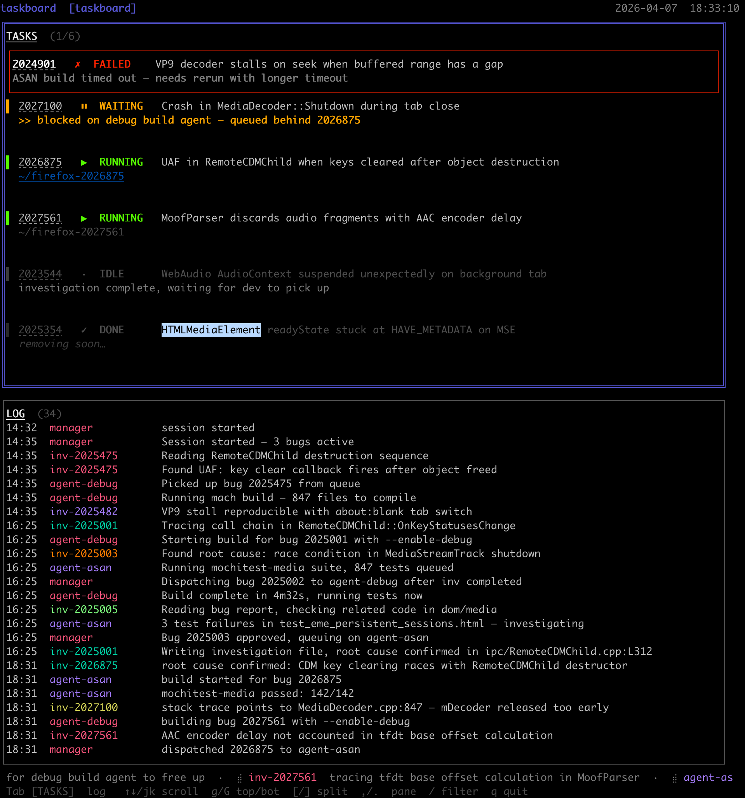

# taskboard

A CLI tool and terminal dashboard for coordinating multi-agent Firefox bug work.
It tracks tasks, agents, file ownership, and build progress across parallel
Claude sessions, with a live Bubble Tea TUI for at-a-glance status.



## Install

**With `go install` (recommended):**

```bash
go install github.com/alastor0325/taskboard/cmd/taskboard@latest
```

Installs to `~/go/bin/taskboard`. Make sure `~/go/bin` is on your `PATH`:

```bash
# add to ~/.zshrc or ~/.bashrc if not already there
export PATH="$HOME/go/bin:$PATH"
```

**From source:**

```bash
git clone https://github.com/alastor0325/taskboard
cd taskboard
make install
```

`make install` builds and copies the binary to `~/.local/bin/taskboard`
(creates the directory if needed, and ad-hoc code-signs on macOS).

## Usage

```
taskboard init                          # start session, write reset marker
taskboard sync                          # re-read team.json, update agent-status.json
taskboard set-task <bug_id> [flags]     # create or partially update a task
  --summary <text>
  --status  <idle|running|waiting|done>
  --note    <text>
  --worktree <path>
taskboard done-task <bug_id>            # mark task done (sets done_at timestamp)
taskboard claim-task <bug_id> <agent>   # atomic claim → {"claimed":true} or {"claimed":false,"owner":"..."}
taskboard who-owns <bug_id>             # ownership query → {"owner":"<agent>" | null}
taskboard file-conflicts <bug_id>       # file conflict check → {"conflicts":[...]}
taskboard log <agent> <message>         # append a log entry to agent-status.json
taskboard btw <agent> <message>         # volatile heartbeat (TTL 120s; agent must be registered)
taskboard notify <log|alert|done> <msg> # log entry + optional Matrix notification
taskboard agent-health <file> [secs]    # liveness check by output file mtime → {"status":"alive"|"stale"|"dead"}
taskboard check-build-progress <dir> [min]  # build stall detection → {"status":"active"|"stalled"|"no_artifacts"}
taskboard tui                           # launch TUI dashboard
taskboard watcher                       # start watcher daemon (auto-syncs on team.json changes, cleans up done tasks)
taskboard healthcheck                   # run one healthcheck pass
taskboard open [--width <pct>]          # split tmux/zellij pane and launch TUI

Global flag:
  --project <name>                      # override project detection
```

## Project detection

When `--project` is not specified, the project name is detected in this order:

1. `TASKBOARD_PROJECT` env var
2. tmux session name (`tmux display-message -p "#S"`)
3. Zellij session name (`$ZELLIJ_SESSION_NAME`)
4. `~/.taskboard/` directory scan (only if exactly one project exists)
5. CWD basename if it starts with `firefox-`
6. Random `session-{hex}` fallback

## Data files

- `~/.taskboard/{project}/team.json` — task and agent state (source of truth)
- `~/.taskboard/{project}/agent-status.json` — TUI data (or `$AGENT_STATUS_FILE`)

### team.json top-level keys

All five keys are always present; missing keys are initialised to `{}` on load:

```
tasks                investigation_agents
build_agents         task_agents
utility_agents
```

## Watcher

`taskboard watcher` polls `team.json` every second and:

- Calls `sync` whenever the file changes (keeps `agent-status.json` up to date).
- Calls `CleanupDone` on every tick, removing tasks that have been in `done` state for more than 5 minutes.
- Uses a per-project PID file and exits immediately if already running.

## Task lifecycle

Valid status transitions enforced by `set-task`:

```
(new) → running
idle  → running | done
waiting → running | idle | done
running → idle | waiting | done
done  → (terminal)
```

`done-task` bypasses the transition table and always sets `done` + `done_at` timestamp.
Done tasks are removed by the watcher after a 5-minute TTL.

## BTW heartbeats

`btw` messages are volatile — they expire after 120 seconds and are only displayed
in the TUI BTW bar. The agent must be registered in `team.json` (investigation,
build, task, or utility agent); unregistered agents are rejected with an error.

## TUI

The TUI dashboard shows tasks and logs in a split layout. Launch with `taskboard tui`
or `taskboard open` (which splits the current pane automatically).

### Task cards

Each task card shows:
- Status badge (`▶ RUN`, `⏸ WAI`, `✓ DON`, `· IDL`, `✗ FAI`) with a color-coded border
- Bug ID (hyperlinked to Bugzilla when numeric) and summary
- Secondary row (priority order): done-expiry countdown → note → worktree basename → BTW message

### Task detail overlay (`Enter`)

Opens a full-detail panel showing:
- **Agents** — investigation and build agent IDs, statuses, build type, queue position
- **Live** — current BTW message from the owning agent
- **Files** — `claimed_files` from `team.json`
- **Note** — task note field
- **Links** — Bugzilla link; review-server link (shown only when the worktree has unpushed patches)

### tmux prerequisite

Add to `~/.tmux.conf` for mouse support:

```tmux
set -g mouse on
```

Without this, mouse wheel scrolling in the TUI will not work inside tmux.

After focusing a tmux pane by clicking, the first click is consumed by tmux to switch
focus — this is expected behaviour. Subsequent clicks/scrolls work normally.

Text selection in tmux requires `Shift+click` (mouse mode intercepts plain clicks).

## TUI keyboard shortcuts

| Key | Scope | Action |
|---|---|---|
| `Tab` | Global | Switch focus: TASKS ↔ LOG |
| `↑↓` / `jk` | Focused section | Move cursor / scroll |
| `g` / `G` | Focused section | Jump to top / bottom |
| `Enter` | TASKS | Open task detail overlay |
| `ESC` | Overlay | Close overlay |
| `/` | LOG | Activate log filter |
| `q` / `ESC` | Global | Quit |
| Mouse wheel | Focused section | Scroll |

## Development

```bash
make build    # build ./taskboard binary
make test     # go test ./...
make lint     # go vet ./...
make install  # install to ~/.local/bin/taskboard
```
